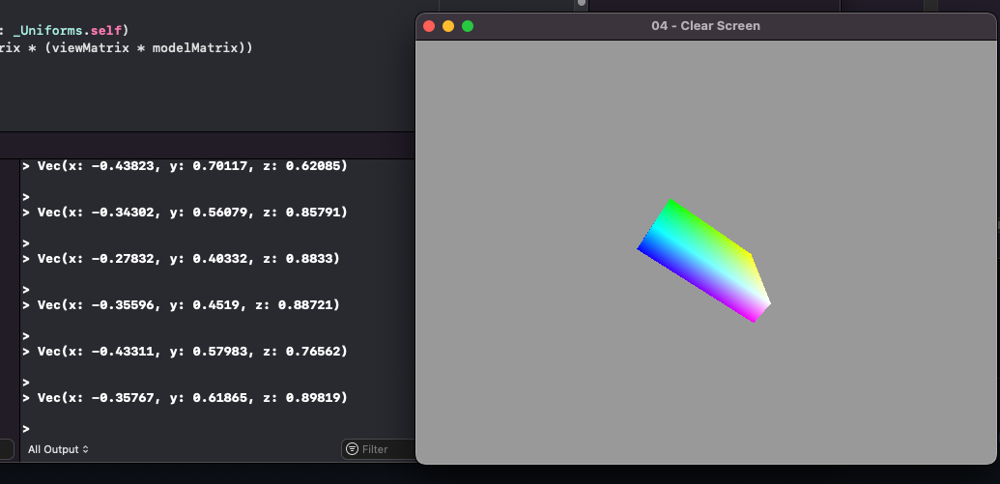

# Accelerometer Viewer

Simple app to listen to the serial port and render a box in the correct orientation. Uses an M5StickC, code in `M5Stick-PlatformIO/`

Sources:
- ORSSerialPort [link](https://github.com/armadsen/ORSSerialPort)
- Metal examples in swift [link](https://github.com/dehesa/Metal)

Todo
- Add model for M5Stick
- iOS support?
- Port to rust
